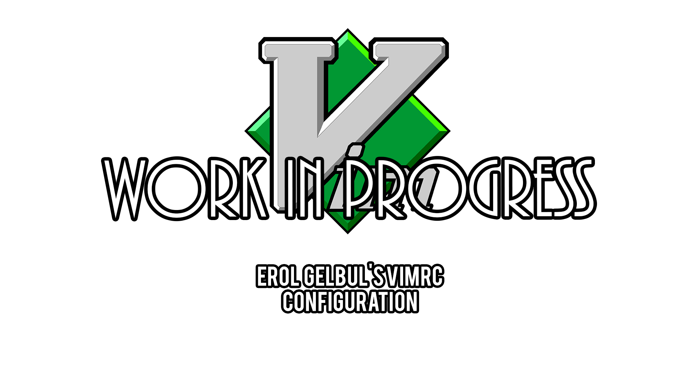

## 1. Custom Commands

1. com! -range -nargs=+ Align defines the Align command, which can be used to align
text. The command takes a range of lines and a separator string as arguments,
and uses the column Unix command to align the text based on the separator.
2. com! -bang ColorUp defines the ColorUp command, which can be used to toggle
syntax highlighting and switch between two different color schemes (darkness and
colorUp). The command takes a ! as an optional argument, which switches the
color scheme.
3. com! CountSpell defines the CountSpell command, which can be used to count the
number of spelling errors in the current buffer. The command uses a custom
Vimscript function (utils#CountSpell()) to count the errors.
4. com! ExecCurrentLine defines the ExecCurrentLine command, which can be used to
execute the current line as a shell command. The command uses the ! command to
execute the current line in a shell.
5. com! -nargs=1 FillLine and com! -nargs=+ FillToColumn define commands to fill
text to a specified column. The FillLine command fills the current line to the
specified column, while the FillToColumn command fills the selected text to the
specified column.
6. com! -nargs=+ Grep defines the Grep command, which can be used to search for a
pattern in the current directory and its subdirectories using the grep Unix
command.
7. com! -nargs=+ GrepRename defines the GrepRename command, which can be used to
search for a pattern in the current directory and its subdirectories, and
replace it with another string. The command uses the tabe command to open the
search results in a new tab, and the cdo command to replace the text.
8. com! InstallPlugins defines the InstallPlugins command, which can be used to
install Vim plugins. The command uses a custom Vimscript function
(utils#InstallPlugins()) to install the plugins.
9. com! -nargs=1 SetFormatProg defines the SetFormatProg command, which can be used
to set the external program used for text formatting. The command takes the name
of the program as an argument and sets the formatprg and formatexpr options.
10. com! -range=% Sort defines the Sort command, which can be used to sort lines in
the selected range. The command uses the sort command to sort the lines.
11. com! -nargs=? Spelling defines the Spelling command, which can be used to toggle
Vim's spell checking feature or set the spell checking language. The command
takes an optional argument to set the language.
12. com! SudoW defines the SudoW command, which can be used to save the current file
with sudo. The command uses the tee Unix command to write the file as the root
user.
13. com! SyntaxStack defines the SyntaxStack command, which can be used to display
the syntax stack for the current cursor position. The command uses the
synstack() function to get the syntax stack.
14. com! -nargs=+ Vimgrep defines the Vimgrep command, which can be used to search
for a pattern in the current directory and its subdirectories using Vim's
vimgrep command.

